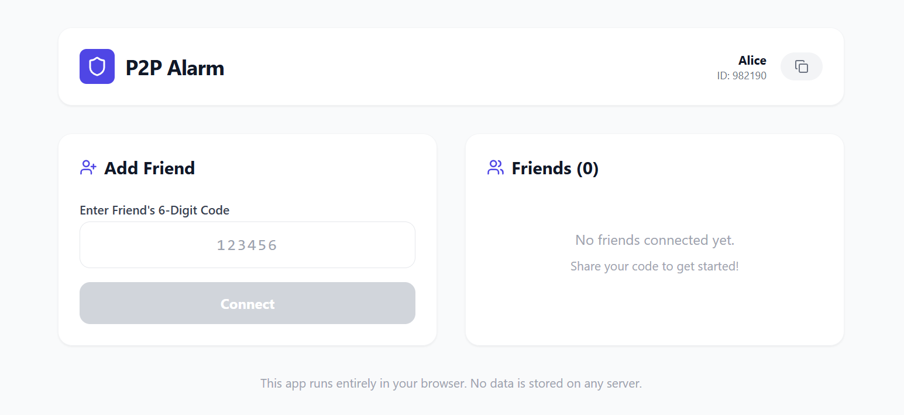

# P2P Alarm Web App

A secure, client-side-only web application that allows you to send instant alarm notifications to your friends and family directly through the browser. Built with privacy and simplicity in mind, this app leverages WebRTC (via PeerJS magic) to establish direct peer-to-peer connections without storing any data on a central server.



## Key Features

-   **Direct P2P Connection**: Connect directly with friends using a simple 6-digit code. No accounts, no logins, no backend database.
-   **Instant Alarms**: Send loud, urgent alarms to connected peers with a single click.
-   **Custom Messages**: Attach custom messages (e.g., "Wake Up!", "Emergency!") to your alarms.
-   **Broadcast Capability**: Connected to multiple friends? Use the **"ALARM ALL"** feature to alert everyone simultaneously.
-   **Username Support**: Set a display name so your friends know exactly who is calling.
-   **Privacy First**: All communication happens directly between browsers. Your data never leaves your device.
-   **Responsive Design**: Works seamlessly on desktop and mobile browsers.

## Tech Stack

-   **Frontend Framework**: [React](https://react.dev/) (v18)
-   **Build Tool**: [Vite](https://vitejs.dev/)
-   **Language**: [TypeScript](https://www.typescriptlang.org/)
-   **P2P Networking**: [PeerJS](https://peerjs.com/) (WebRTC wrapper)
-   **Styling**: [Tailwind CSS](https://tailwindcss.com/)
-   **Icons**: [Lucide React](https://lucide.dev/)

## Getting Started

### Prerequisites

-   Node.js (v16 or higher)
-   npm or yarn

### Installation

1.  **Clone the repository**
    ```bash
    git clone https://github.com/srini-abhiram/p2p-alarm-app.git
    cd p2p-alarm-app
    ```

2.  **Install dependencies**
    ```bash
    npm install
    ```

3.  **Start the development server**
    ```bash
    npm run dev
    ```

4.  **Open in Browser**
    Navigate to `http://localhost:5173` (or the URL shown in your terminal).

## How to Use

1.  **Set a Username**: When you first open the app, enter a username (e.g., "Alice").
2.  **Share Your ID**: You will be assigned a unique 6-digit ID (displayed in the header). Share this ID with a friend.
3.  **Connect**:
    -   Ask your friend to enter your 6-digit ID in the "Add Friend" section.
    -   Click **Connect**.
4.  **Send Alarm**:
    -   Once connected, your friend will appear in your list.
    -   Type an optional message.
    -   Click **ALARM** to send a notification to that specific friend.
    -   Or click **ALARM ALL** to alert everyone in your list.

## Privacy & Security

-   **No Data Storage**: We do not store your messages, connections, or personal information.
-   **Ephemeral Connections**: Connections are live only while the browser tab is open.
-   **Client-Side Logic**: All logic runs locally in your browser.

## Contributing

Contributions are welcome! Please feel free to submit a Pull Request.

## License

This project is licensed under the MIT License.
